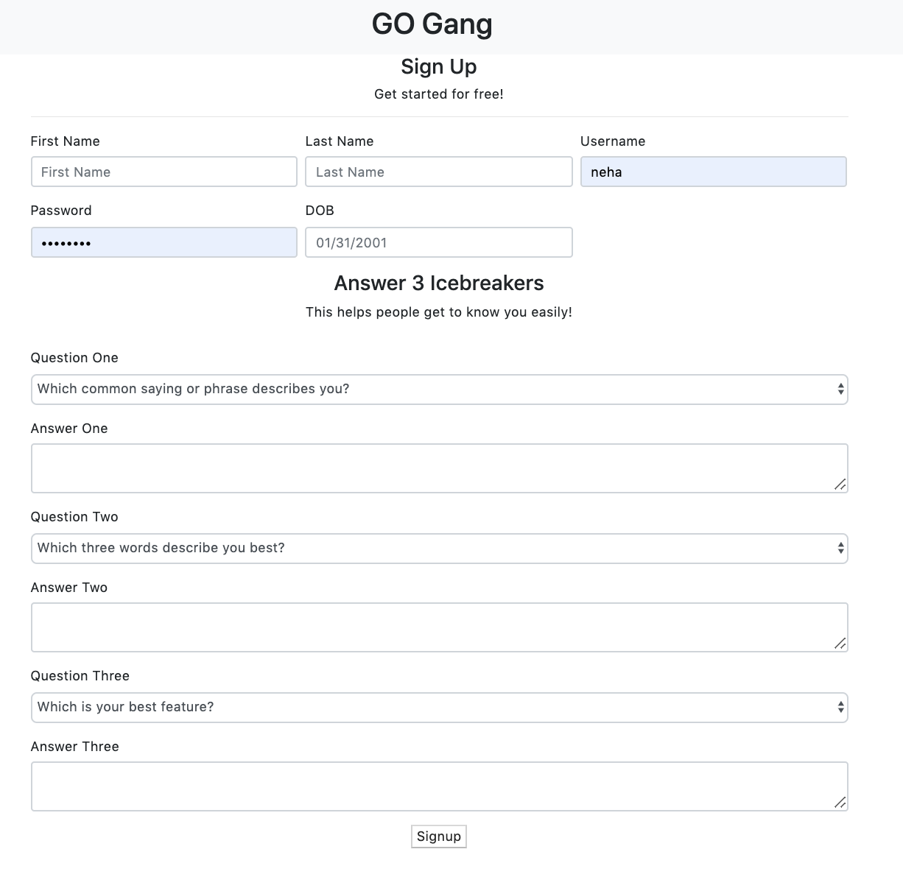
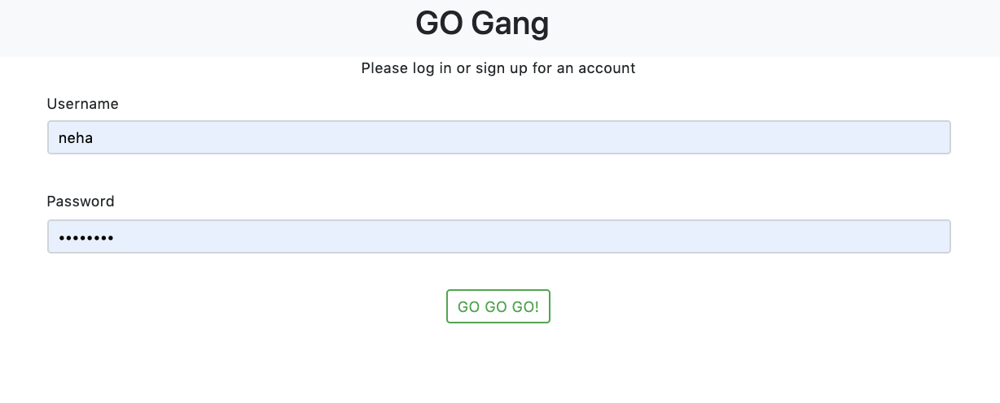
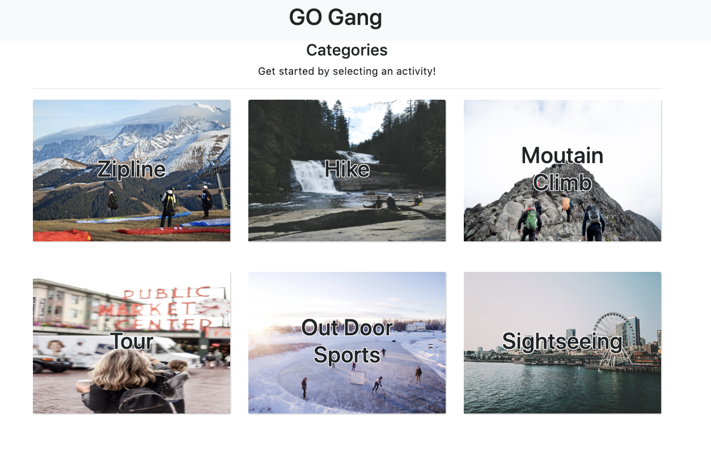
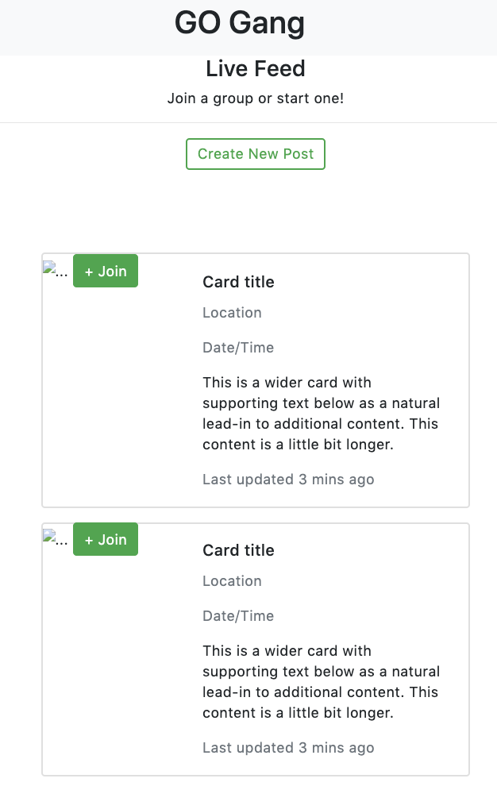
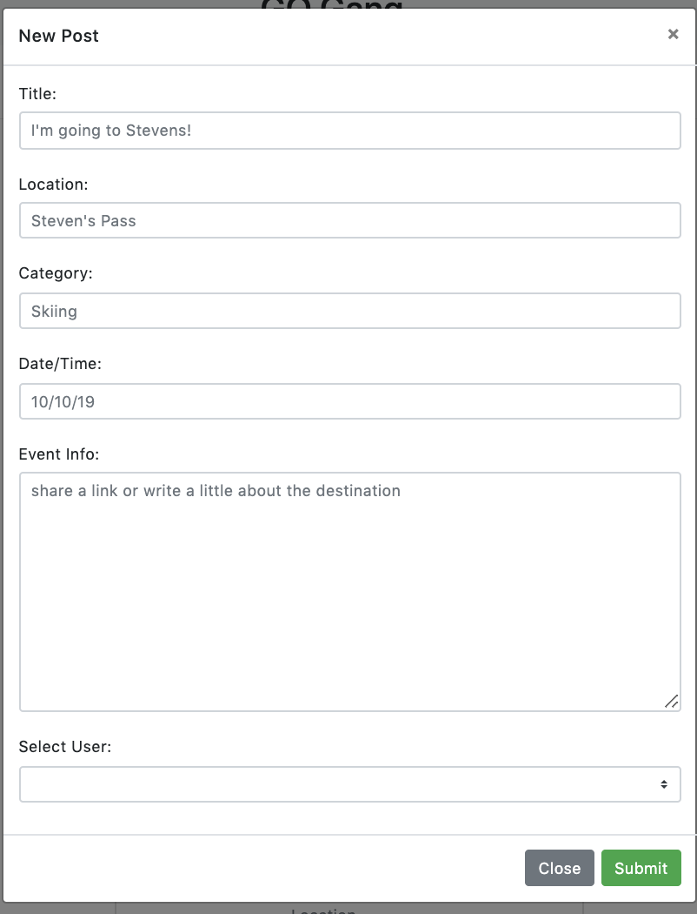

### Go Gang
 - **Who:** 18+, 2 people or more
 - **What:** group meetup for things to do
 - **Where:** in PNW
 - **When:** anytime, anywhere
 - **Why:** to solve the issue of wanting to do activities socially but no one else to go with
 - **How:** filters for age preference, location, activities and date

This app is designed to link people together who want to do last minitue activities but dont have anyone to do them with. 

The user needs to create and account in order to post on this app. 

If user already has an account, they can log in via the login page.

The user will chose a category from the category page.

After this, they will get redirected to a livefeed page for that activity. 

To make a new activity post, user will post their activity title, location, category, date/time and a little info about the activity on to this live feed page.
 

Other users will log into the app and see the activities in the different categories and they can chose which ones they would like to join. 

Deployed Heroku Link:
https://go-gang.herokuapp.com/